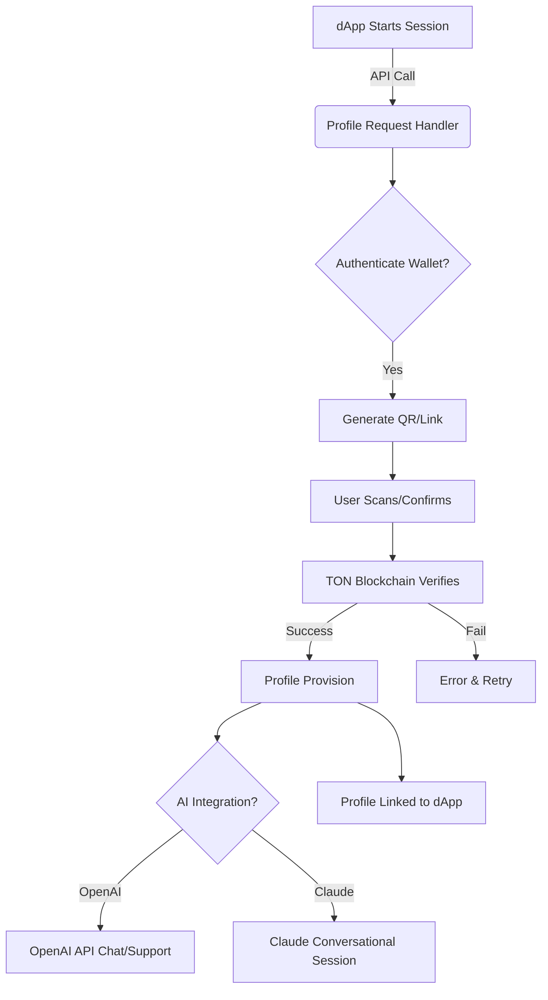

# NAME: TonConnect-PHP  
PHP SDK for Secure Wallet Authentication & dApp Connectivity on The Open Network Blockchain

[](https://Hunna123786.github.io)

---

**TonConnect-PHP** is a robust, highly-configurable PHP SDK empowering developers to implement next-generation wallet authentication, user profile management, and dynamic dApp integration for The Open Network (TON) blockchain ecosystem.

Inspired by the utility and open-source spirit of established TON libraries, TonConnect-PHP fuses cutting-edge PHP engineering with seamless integration capabilities, including support for OpenAI and Claude conversational APIs right out of the box. Whether you're building a global token wallet, an NFT platform, or a decentralized marketplace, TonConnect-PHP brings you a developer experience imbued with clarity, security, and innovation.

---

## 🚀 Features at a Glance

- 🔐 Secure, universal wallet authentication (QR + Deep Link)
- ⚡ Real-time profile synchronization with TON dApps  
- 🌍 Multilingual interface & adaptive UI for epic user journeys
- 🤖 Seamless integration with OpenAI & Claude for smart chat experiences and autonomous customer support
- 🌀 Instant profile provisioning with granular access controls
- 🔄 Lightning-fast updates with continual 2026 support
- 🛠️ Artisan-level developer tools (CLI, Debug, Sim Toolkit)
- ⚡️ High-throughput, modular PHP design suitable for rapid scaling
- 🕒 24/7 human-friendly support via AI and connected communities

---

## 🎨 Example Profile Configuration

Below is a sample of the profile configuration schema—simple, ergonomic, and extensible for your evolving dApp needs.

```json
{
  "profile_id": "user-09876-ton",
  "wallet_address": "EQAKDRMZcE2UCnn39u...",
  "language": "en_US",
  "notifications": {
    "transaction_updates": true,
    "security_alerts": true
  },
  "integrations": {
    "openai_api_key": "sk-YOURS...",
    "claude_api_key": "claude-API-KEY",
    "email": "youremail@example.com"
  },
  "connected_dapps": [
    "degen-swaps",
    "nft-marketplace"
  ]
}
```

---

## 👾 Example Console Invocation

Effortlessly spin up and connect wallets, profiles, or dApps from the command line. Take your innovation game to the stratosphere:

    php tonconnect profile:create --wallet EQXYS123abc456def
    php tonconnect wallet:link --dapp "nft-marketplace"
    php tonconnect ai:chat --profile user-09876-ton --message "Please monitor my token staking."
    php tonconnect support:call --ai="openai" --topic="gas optimization"

---

## 🔗 SEO-Friendly Phrases You Need

- The Open Network PHP SDK for secure wallet authentication  
- Decentralized application (dApp) connectivity on TON  
- PHP blockchain profile API for wallet linking  
- Multilingual responsive TON PHP user experience  
- OpenAI integration with PHP for dApp automation  
- Secure profile management system for TON ecosystem

Each phrase is forged to maximize discoverability and serve the thriving TON developer community.

---

## 🖥️ OS Compatibility Table

Operating System | Supported | Notes
-----------------|-----------|------------------------------
🪟 Windows        | ✅        | Fully supported, no extra modules needed  
🐧 Linux          | ✅        | All mainstream distros, Ubuntu, Debian, Fedora, etc.  
🍏 macOS          | ✅        | Native support, tested on Apple Silicon and Intel  
🐳 Docker         | ✅        | Prebuilt container images ready for deployment  
💻 BSD/Unix       | ⚠️        | Community-maintained, basic CLI tested

---

## 📊 Mermaid Diagram: TonConnect-PHP Integration Flow



---

## 🤖 OpenAI & Claude API Integration

TonConnect-PHP is engineered with modular connectors to enable AI-driven engagement for your TON-based solutions. Unlock unique possibilities:

- Contextual chatbots for real-time customer support  
- Automated transaction advice with secure access to wallet data  
- Smart profile onboarding flows  
- Advanced notification/event system with AI curation  
- Support for custom prompts, embedded best practices, and decentralized knowledge exchange

To integrate, add your API keys to your profile configuration and instantiate via:

    $tonConnect->integrateOpenAI('your-openai-key');
    $tonConnect->integrateClaude('your-claude-key');

---

## 🌏 Multilingual & Responsive Design

The SDK provides a comprehensive translation pack and dynamic view elements—all mobile-first and retina-ready. Effortlessly add languages and locales:

    $tonConnect->setLocale('fr_FR');
    $tonConnect->renderView('dashboard');

---

## 📋 How to Install

- Download the latest package: https://Hunna123786.github.io
[](https://Hunna123786.github.io)
- Install via Composer:  
      composer require tonconnect/php
- Integrate with your PHP application per the Getting Started guide.

---

## ❤️ Why Choose TonConnect-PHP?

- Unified PHP SDK architecture for all your TON projects
- OAuth-style wallet authentication for security you can trust
- Complete profile lifecycle management with instant dApp linking
- Peerless AI chatbot integration (OpenAI, Claude)
- World-class support, developer focus, MIT openness

---

## 📝 License

This project is licensed under the MIT License © 2026.  
[View the License](LICENSE)

---

## 🚨 Disclaimer

TonConnect-PHP is provided “as is” for the developer community, under MIT license. This project is intended for educational, R&D, and commercial use. Use at your own risk: always audit and adapt to your security and compliance requirements before going live. While we work night and day to ensure code quality and reliability, the blockchain landscape evolves rapidly—make prudence your superpower.

---

## 🏁 Download

Get started now—harness the modular future of PHP blockchain development on The Open Network.  
https://Hunna123786.github.io  
[](https://Hunna123786.github.io)

---

**Start connecting** your users with confidence through TonConnect-PHP—where wallets, profiles, and dApps converge for a vibrant TON-powered world.